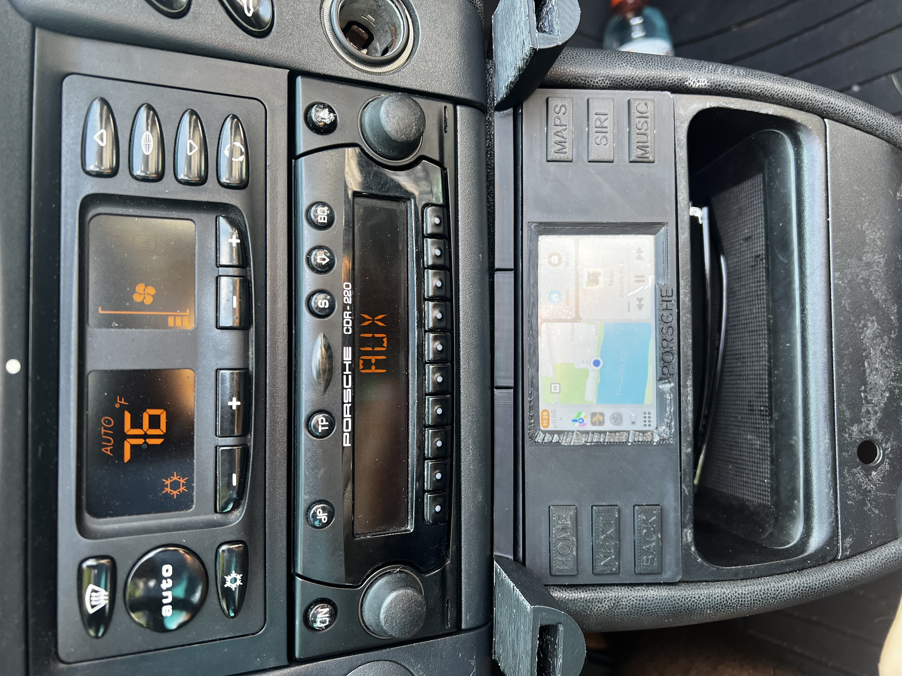

# Porsche 986 3D Printable Fascia with Touch Screen and Buttons

This project is a 3D printable fascia for the Porsche 986 that adds a touch screen and buttons for an enhanced infotainment experience. The fascia is designed to seamlessly integrate with the car's interior while providing modern functionality.

## Features

- 3D printable fascia designed specifically for the Porsche 986
- Integrated touch screen display for easy navigation and control
- Tactile buttons for quick access to frequently used functions
- Wireless Android Auto and CarPlay support via Carlinkit dongle
- Powered by a Raspberry Pi 3B+ for reliable performance

## Hardware

The following hardware components were used in this project:

- [Raspberry Pi 3B+](https://www.raspberrypi.com/products/raspberry-pi-3-model-b-plus/)
- [USB to 3.5mm Jack Mic/Headphone](https://www.amazon.com/Plugable-Headphone-Microphone-Aluminum-Compatible/dp/B00NMXY2MO?source=ps-sl-shoppingads-lpcontext&ref_=fplfs&psc=1&smid=A3HIHADV23VGU1)
- [Carlinkit Wireless Android Auto Dongle](https://www.carlinkit.store/products/carlinkit-usb-dongle-wireless-carplay-android-auto-box-wired-mirrorlink-for-aftermarket-android-screen-car-multimedia-player-bluetooth-auto-connect)
- [Waveshare 3.5" Capacitive Touch LCD 480x800](https://www.amazon.com/waveshare-Capacitive-Adjustable-Brightness-Raspberry/dp/B0BV2SH8F3/ref=sr_1_5?crid=33S1VIQ1TU9D8&dib=eyJ2IjoiMSJ9.eN0h6Y9OddKl7eBlF2LVnunAjVu35yvPd3S_1pakrcbLIPwfpWzam3HdeebgR4CoX76N-dJfg4AEOn9px5XXh2AW1chdeWAE557uv1PtV9Gx3UPBjS8zgjruVvxh15mnhq5PNUZJPWg1o48aDvpJL_AidcP_znP0SqzwzY2WSj8pTUwp45h1AlGpxjI2Oqv26hVXBrbXjUgIT7aBsK35ekXpu581xFVRCxaMJgVp9hhl8cLQOm1TcYAHHk01dCMtVF3z8RKaeDVTpHiGDHh8B3leowvukia7VcVo7ybhgb0.kqzZSAYsBMd6iJnFZLkQn4KguK1pwS2je9Y_CGKoWP0&dib_tag=se&keywords=3.5%22+hdmi+capacitive+touch&qid=1714568717&s=electronics&sprefix=3.5+hdmi+capacitive+touch%2Celectronics%2C147&sr=1-5)
- [LED Tactile Switches (for buttons)](https://www.amazon.com/dp/B09JFS91YM?ref=nb_sb_ss_w_as-reorder_k1_1_15&amp=&crid=33JVR2NPB8139&amp=&sprefix=led+tactile+swi)

## 3D Model

The 3D model for the fascia is designed to fit perfectly in the Porsche 986. It accommodates the touch screen display and provides cutouts for the tactile buttons.

## Software

The software for this project is forked from the excellent work of [Birkir Gudjonsson](https://github.com/birkir). Special thanks to Birkir for creating the foundation for this project.

## Installation

1. 3D print the fascia using the provided STL file.
2. Assemble the hardware components according to the wiring diagram.
3. Install the necessary software dependencies on the Raspberry Pi.
4. Flash the Raspberry Pi with the provided software image.
5. Mount the fascia in your Porsche 986 and enjoy the enhanced infotainment experience!

## Acknowledgements

- [Birkir Gudjonsson](https://github.com/birkir) for the original software implementation.
- The Porsche community for their support and feedback throughout the development process.

Feel free to reach out if you have any questions or suggestions for improving this project. Happy driving!